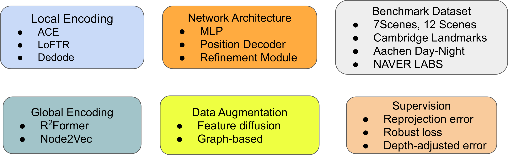

    <!--  -->
    <h1 align="center">SCRStudio   A Unified Framework for Scene Coordinate Regression</h1>
        <!-- <h3 align="center"><a href="https://arxiv.org/abs/2406.04340">Arxiv</a>  -->
    

# About
SCRStudio is a unified and modular framework for Scene Coordinate Regression (SCR)-based visual localization, built on top of the awesome [nerfstudio](https://github.com/nerfstudio-project/nerfstudio) project.

The library supports a more interpretable implementation of SCRs by modularizing each component from input encoding, network architecture, to supervision strategies. We provide a unified implementation of three major SCR methods: ACE, GLACE, and R-SCoRe. It supports various pretrained local encoding, both sparse and dense, while also incorporates state-of-the-art techniques for integrating global encodings.

# Release Plan
We are actively preparing SCRStudio for public release. Below is the tentative schedule:  

- [ ] March 2025: Initial release of SCRStudio.
- [ ] April 2025: SCRStudio Viewer.
